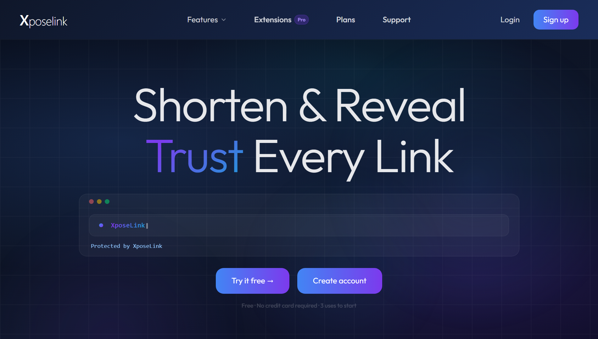
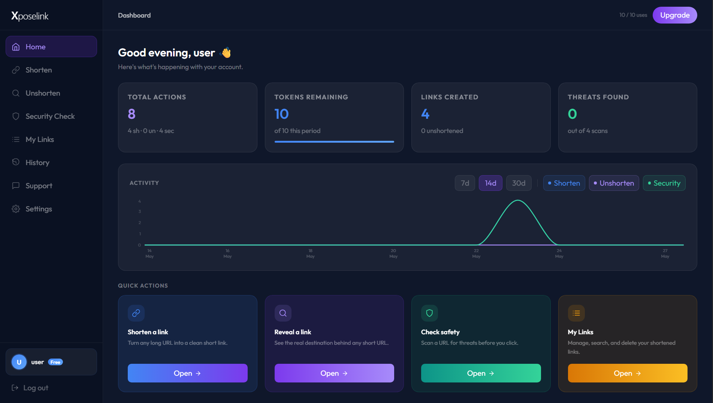
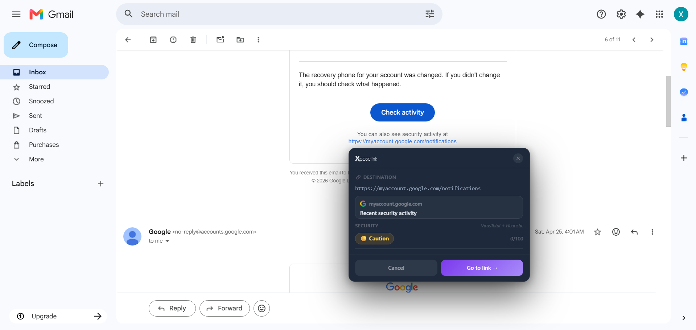
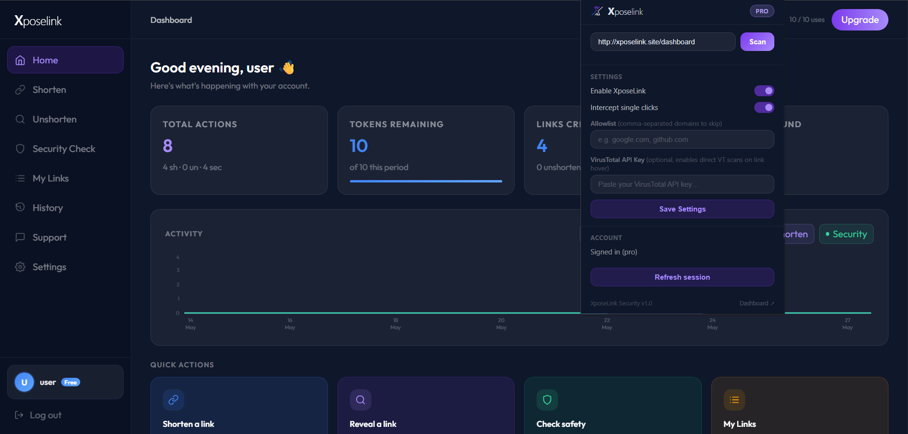

<table align="center" border="0">
  <tr>
    <td align="center" width="140">
      
    </td>
    <td align="center">
      <h1>Xposelink</h1>
      <p><em>Shorten &amp; Reveal — Trust Every Link</em></p>
    </td>
    <td align="center" width="140">
      
    </td>
  </tr>
</table>

<p align="center">
  A URL safety toolkit that shortens links, reveals where short links really go, and scans any address for malware, phishing, adult content, and gambling. It ships with a web dashboard and a Chrome extension that checks links while you browse.
</p>

## Table of contents

1. [Screenshots](#screenshots)
2. [Features](#features)
3. [How the security check works](#how-the-security-check-works)
4. [Tech stack](#tech-stack)
5. [Project structure](#project-structure)
6. [Getting started](#getting-started)
7. [Subscription tiers and tokens](#subscription-tiers-and-tokens)
8. [Browser extension](#browser-extension)
9. [Production deployment](#production-deployment)
10. [Environment variables](#environment-variables)
11. [Security notes](#security-notes)

## Screenshots

> Capture these from your running app and save them in `docs/screenshots/` with the exact filenames below. They will render automatically once added.

| Landing page | Dashboard |
| :---: | :---: |
|  |  |

| Security scan result | Chrome extension popup |
| :---: | :---: |
|  |  |

## Features

* Shorten long URLs, with optional custom aliases for Pro and Team accounts.
* Unshorten any short link and trace the full redirect chain to the real destination.
* Scan a URL for malware, phishing, adult content, and gambling before you open it.
* Click analytics for your links, including totals, country, and city.
* Usage history with a chart covering the last 7 to 90 days.
* Chrome extension that intercepts link clicks and shows a safety verdict before you navigate.
* Account tiers with a monthly token budget, plus a guest mode for visitors who are not signed in.
* Email verification and password reset flows.
* Admin area for managing users, links, transactions, and support tickets.

## How the security check works

Every scan runs through three layers and returns the strongest signal it finds.

1. **Google Safe Browsing.** Real time lookup for phishing, malware, and unwanted software. Used when `GOOGLE_SAFE_BROWSING_API_KEY` is set.
2. **VirusTotal.** Vendor based detection for malware and phishing. Used when `VIRUSTOTAL_API_KEY` is set.
3. **Heuristics.** Keyword and domain matching for adult content, gambling, and suspicious patterns. This layer always runs, so the scanner still works with no API keys configured.

If Google Safe Browsing flags a URL it takes priority. Otherwise the VirusTotal result is used. If both are unavailable the heuristic result is returned.

## Tech stack

| Area | Technology |
| :--- | :--- |
| Backend | Node.js, Express, MySQL (via mysql2), JSON Web Tokens |
| Frontend | React, Vite, Tailwind CSS, React Router, Recharts |
| Extension | Chrome Manifest V3 service worker and content script |
| Payments | Midtrans (Snap and card tokenization) |
| Email | Nodemailer over SMTP |
| Reverse proxy | Caddy (used in the Docker setup) |

## Project structure

```
Xposelink/
  backend/        Express API: routes, controllers, services, models, MySQL
  frontend/       React + Vite single page app and dashboard
  extension/      Chrome extension (background worker, content script, popup)
  docs/           Documentation assets such as screenshots
  Caddyfile       Reverse proxy config for the Docker stack
  docker-compose.yml
  .env.example    Template for environment variables
```

The backend follows a layered pattern. Routes mount controllers, controllers handle the request and response, services hold the business logic, and models talk to MySQL using parameterized queries.

## Getting started

### Prerequisites

* Node.js and npm
* A running MySQL server (for example through XAMPP or a standalone MySQL install)

### 1. Configure environment variables

Copy the template and fill in your own values.

```
cp .env.example .env
```

At minimum set your MySQL credentials, a `JWT_SECRET`, and the admin email and password. API keys for VirusTotal, Google Safe Browsing, Midtrans, and SMTP are optional. The same `.env` file in the project root is read by both the backend and the frontend build.

### 2. Install dependencies

```
cd backend
npm install
cd ../frontend
npm install
```

### 3. Run the backend

Open a terminal and start the API on http://localhost:3000.

```
cd backend
npm run dev
```

The database tables are created on the first run if they do not already exist.

### 4. Run the frontend

Open a second terminal and start the dashboard on http://localhost:5173.

```
cd frontend
npm run dev
```

Visit http://localhost:5173 in your browser, register an account, and sign in.

### Tests

The backend uses the Node.js built in test runner. Place test files under `backend/tests/` and run them with:

```
cd backend
npm test
```

## Subscription tiers and tokens

Each account has a monthly token budget. Shorten and unshorten both spend one token per action. Security checks spend a token on the Free tier and are unlimited on paid tiers. The admin account has no limits.

| Tier | Monthly tokens | Custom alias | Security checks | Extension |
| :--- | :--- | :--- | :--- | :--- |
| Free | 10 (shorten, unshorten, and security) | No | Counts against tokens | No |
| Pro | 50 (shorten and unshorten) | Yes | Unlimited | Yes |
| Team | 100 (shorten and unshorten) | Yes | Unlimited | Yes |
| Admin | Unlimited | Yes | Unlimited | Yes |

Visitors who are not signed in get a small guest allowance tracked by IP address, so they can try the tools before creating an account.

## Browser extension

The extension adds a safety layer while you browse.

### Load it for development

1. Open `chrome://extensions/` in Chrome.
2. Turn on Developer mode.
3. Click **Load unpacked** and select the `extension/` folder.

### What it does

* **Right click menu.** Shorten a link, unshorten a link, or scan it with Xposelink. The result is copied to your clipboard and shown in the popup.
* **Click interception.** When enabled, clicking a link first resolves and scans the destination, then shows a verdict before you continue. This feature is available on Pro and higher accounts and does not spend tokens.
* **Popup scanner.** Paste any URL and scan it on demand.

### Sign in

The extension reads your session from the Xposelink site. Sign in on the dashboard first, then open the extension popup and click **Refresh session**.

## Production deployment

Authentication uses an HTTPOnly cookie, and the extension needs that cookie to work across origins. Keep the following in mind before going live.

### 1. Set the environment mode

Set `NODE_ENV=production` to switch the auth cookie to `Secure` and `SameSite=None`, which the extension needs for cross origin requests over HTTPS.

### 2. Serve the backend over HTTPS

Browsers reject `Secure` cookies on plain HTTP. Put the backend behind a reverse proxy such as Caddy, nginx, or Cloudflare, or use a host that terminates TLS for you. The backend trusts the `X-Forwarded-Proto` and `X-Forwarded-For` headers.

### 3. Set absolute URLs

```
PUBLIC_BASE_URL=https://api.your-domain.com
FRONTEND_URL=https://your-domain.com
```

CORS only allows requests from `FRONTEND_URL` plus any `chrome-extension://` origin, so it must match your deployed frontend exactly.

### 4. Build the frontend

```
cd frontend
VITE_API_BASE_URL=https://api.your-domain.com npm run build
```

Serve the contents of `frontend/dist/` from any static host.

### 5. Point the extension at production

Open the extension popup, go to Settings, and set the API base URL to your production backend.

### Docker option

The repository includes a `docker-compose.yml` and a `Caddyfile` for running the full stack (MySQL, backend, frontend, and Caddy) in containers.

```
cp .env.example .env   # edit values, and set DB_HOST=mysql for Docker
docker compose up -d --build
```

Use `docker compose up -d --build` whenever you pull new code. A plain restart reuses the old image and will keep running the previous build.

## Environment variables

Set these in a `.env` file in the project root. See `.env.example` for the full list.

| Variable | Required | Purpose |
| :--- | :--- | :--- |
| `JWT_SECRET` | Yes | Secret used to sign session tokens |
| `DB_HOST`, `DB_PORT`, `DB_USER`, `DB_PASS`, `DB_NAME` | Yes | MySQL connection |
| `PORT` | Yes | Backend port, default 3000 |
| `PUBLIC_BASE_URL` | Yes | Base URL of the backend, used for short links and cookies |
| `FRONTEND_URL` | Yes | Allowed origin for CORS and cookies |
| `ADMIN_EMAIL`, `ADMIN_PASSWORD` | Yes | Seeds the admin account on first run |
| `VIRUSTOTAL_API_KEY` | Optional | Enables VirusTotal scanning |
| `GOOGLE_SAFE_BROWSING_API_KEY` | Optional | Enables Google Safe Browsing scanning |
| `MIDTRANS_SERVER_KEY`, `MIDTRANS_CLIENT_KEY` | Optional | Payment gateway |
| `SMTP_HOST`, `SMTP_PORT`, `SMTP_USER`, `SMTP_PASS`, `EMAIL_FROM` | Optional | Outgoing email |

## Security notes

* The admin account is seeded only from `ADMIN_EMAIL` and `ADMIN_PASSWORD`, never hardcoded.
* All database queries use parameterized statements to prevent SQL injection.
* CORS is restricted to `FRONTEND_URL` and `chrome-extension://` origins.
* Rate limiting protects the auth and scan endpoints.
* If your `.env` file was ever committed to version control, rotate `JWT_SECRET`, `VIRUSTOTAL_API_KEY`, `SMTP_PASS`, `MIDTRANS_SERVER_KEY`, and `ADMIN_PASSWORD` before going live. Changing the JWT secret signs every existing user out.
